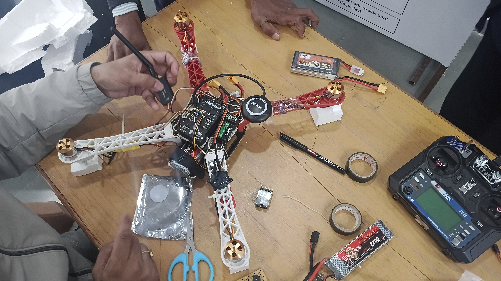
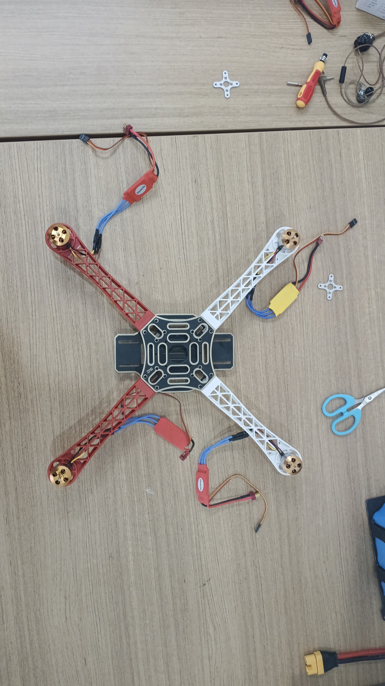

# F450 Quadcopter with Onboard Face Detection

A university drone project: a hand-built **F450 quadcopter** running a **Pixhawk 2.4.8** flight controller, with a **Raspberry Pi 3B+ companion computer** performing **real-time face detection** through a Pi Camera. The drone features GPS-assisted flight modes, long-range radio telemetry, 3D-printed structural parts, and a measured flight endurance of **~18 minutes**.



## Highlights

- 🛠 **Fully hand-assembled** F450 (450 mm) quadcopter platform
- 🧠 **Pixhawk 2.4.8** flight controller on an anti-vibration damper mount
- 🛰 **u-blox NEO-M8N GPS + compass** on a custom **3D-printed mast mount** (raised above the frame to reduce magnetic interference from the power system)
- 📷 **Raspberry Pi 3B+ + Pi Camera** running OpenCV Haar-cascade face detection onboard
- 📡 **Radio telemetry link** to a ground station (Mission Planner) for live flight data
- 🔋 **2200 mAh 3S LiPo** power system → ~18 min flight time
- 🖨 Multiple **3D-printed parts** (GPS mast, camera mount) and vibration dampers throughout

## Build Gallery

| Frame, motors & ESC assembly | Avionics integration |
|---|---|
|  |  |

🎥 **Flight test videos:**
- [Full flight test](media/flight-test-full.mp4)
- [Short flight clip](media/flight-test-short.mp4)

## System Architecture

```
   FlySky FS-i6 transmitter                Ground station (Mission Planner)
        (2.4 GHz RC)                                 │
             │                              telemetry radio link
             ▼                                       ▼
      FS-iA6B receiver ────► ┌──────────────────────────────┐
                             │        Pixhawk 2.4.8         │◄── NEO-M8N GPS + compass
                             │   (on vibration dampers)     │    (3D-printed mast mount)
                             └──────────────┬───────────────┘
                                            │ PWM ×4
                                   30 A ESCs ×4
                                            │
                            A2212 1100 KV motors + 10×4.5 props

      Pi Camera ──CSI──► Raspberry Pi 3B+ ──► OpenCV face detection
                          (companion computer, powered from 5 V BEC)
```

The flight stack (stabilisation, GPS position hold, RTL, failsafes) runs entirely on the Pixhawk. The Raspberry Pi is an independent onboard vision computer: it captures video from the Pi Camera and runs face detection in real time, saving annotated detection frames.

## Hardware Specifications

| Subsystem | Component |
|---|---|
| Frame | F450 (450 mm wheelbase) with integrated PDB |
| Flight controller | Pixhawk 2.4.8 (ArduPilot) on anti-vibration mount |
| Motors | A2212 1100 KV brushless ×4 |
| ESCs | 30 A ×4 |
| Propellers | 10×4.5 (1045), 2×CW + 2×CCW |
| Battery | 3S 11.1 V 2200 mAh LiPo |
| GPS | u-blox NEO-M8N with compass, 3D-printed mast mount |
| RC link | FlySky FS-i6 TX / FS-iA6B RX (2.4 GHz) |
| Telemetry | Radio telemetry pair → Mission Planner ground station |
| Companion computer | Raspberry Pi 3B+ |
| Camera | Raspberry Pi Camera (CSI) |
| Flight time | ~18 minutes (measured) |

Full parts list with costs: **[docs/BOM.md](docs/BOM.md)**

## Face Detection

The onboard vision system lives in [src/face_detection.py](src/face_detection.py). It:

1. Grabs frames from the Pi Camera (via `picamera2`, with an OpenCV `VideoCapture` fallback for the legacy camera stack).
2. Runs an OpenCV **Haar-cascade frontal-face detector** on each frame (tuned for the Pi 3B+'s CPU: 640×480 grayscale, scale factor 1.2).
3. Draws bounding boxes and an FPS counter, and optionally saves an annotated snapshot of every detection.

### Run it on the Pi

```bash
sudo apt install -y python3-opencv python3-picamera2   # Raspberry Pi OS
python3 src/face_detection.py                          # live preview window
python3 src/face_detection.py --headless               # over SSH / no display
python3 src/face_detection.py --save-dir detections/   # save detection snapshots
```

## 3D-Printed Parts

- **GPS mast mount** — raises the NEO-M8N above the frame, away from ESC/PDB magnetic noise, improving compass health and GPS lock.
- **Camera mount** — front-mounted bracket for the Pi Camera.
- Anti-vibration dampers isolate the Pixhawk from motor vibration for cleaner IMU data.

## Repository Structure

```
├── README.md              ← you are here
├── docs/
│   └── BOM.md             ← full bill of materials with costs
├── src/
│   └── face_detection.py  ← onboard face detection (Raspberry Pi)
├── requirements.txt
└── media/                 ← build photos & flight test videos
```

## License

[MIT](LICENSE) © Atharve Dahima
